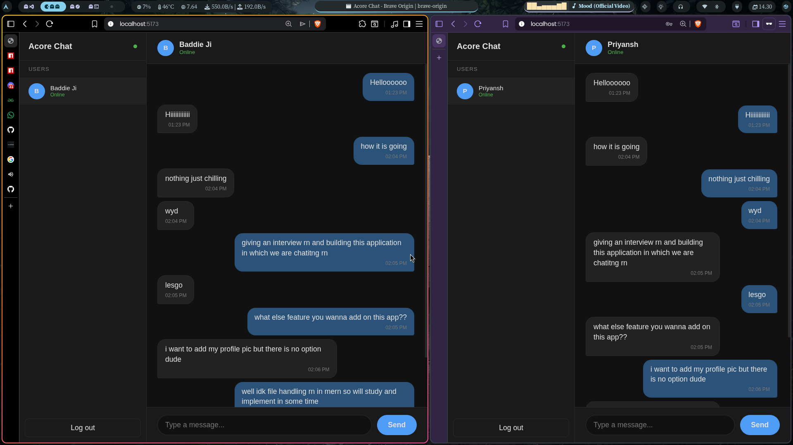
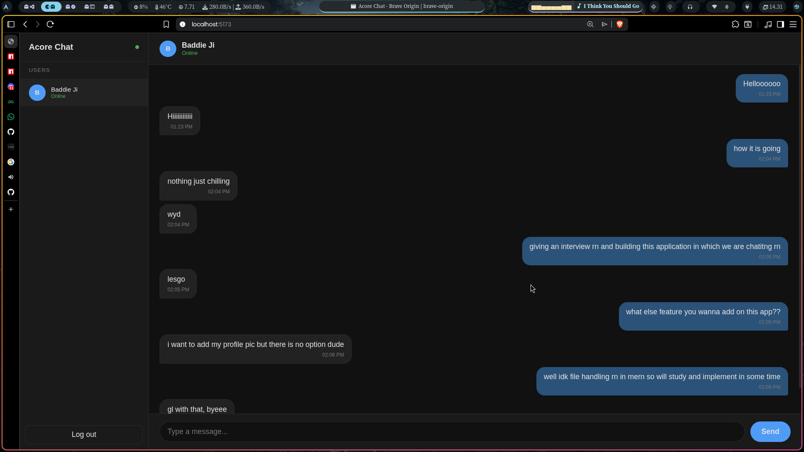

# ACORE chat app

## Tech Used
- React 
- Express
- MariaDB (a sql database coz idk mongodb but i am learning it, you can use MySQl instead, my archlinux supports mariadb as i used it)


## How to run this localy?

#### Frontend
```
cd frontend
npm run dev

```
now frontend is running at localhost:5173

#### Backend 
```
cd backend
npm run start
```

now backend will run at localhost:3000

#### Database
Use MySQL

first add your mysql login id and password in inside backend/.env and then just run the sql query to init the db and create the tabless from `schema.sql` file 


API EndPoints
- localhost:3000/api/auth/register, POST, no auth, create acco req fields name, email, password
- localhost:3000/api/auth/login, POST, no auth, login the existing registered users
- localhost:3000/api/messages/users, GET, JWT auth, list users and status
- localhost:3000/api/messages/:id, GET, JWT auth, get user msgs 


## Postman 
postman collection file is at [AcoreChat.postman_collection.json](https://github.com/priyazsh/acorechatapp/blob/main/AcoreChat.postman_collection.json)
## Screenshots





### Off Topic 
my best work till now which got me 450+ stars on github, and 150+ emails on waitlist as i am relaunching
- https://github.com/is-a-software/is-a-software

